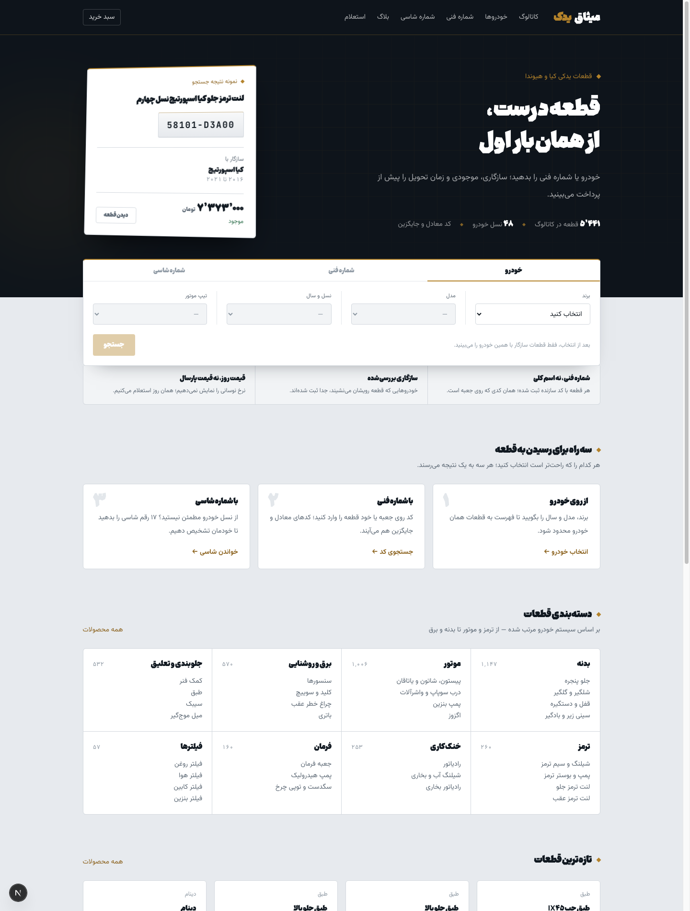
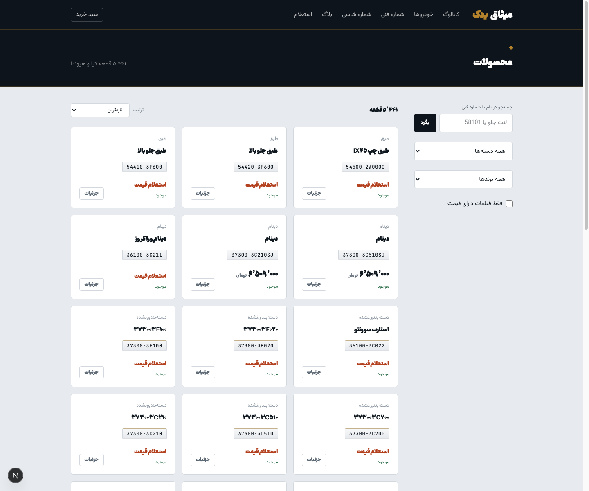
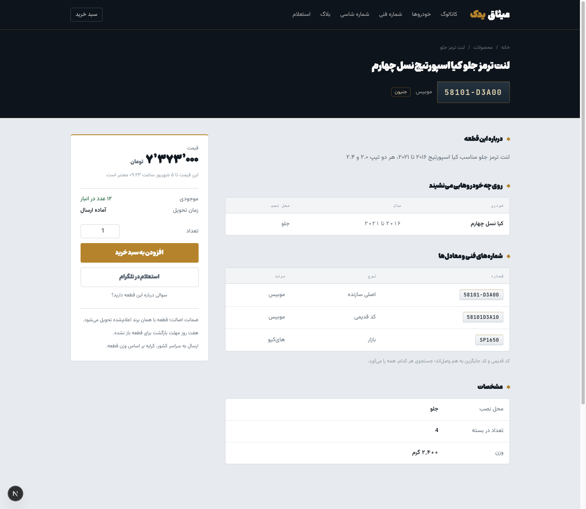
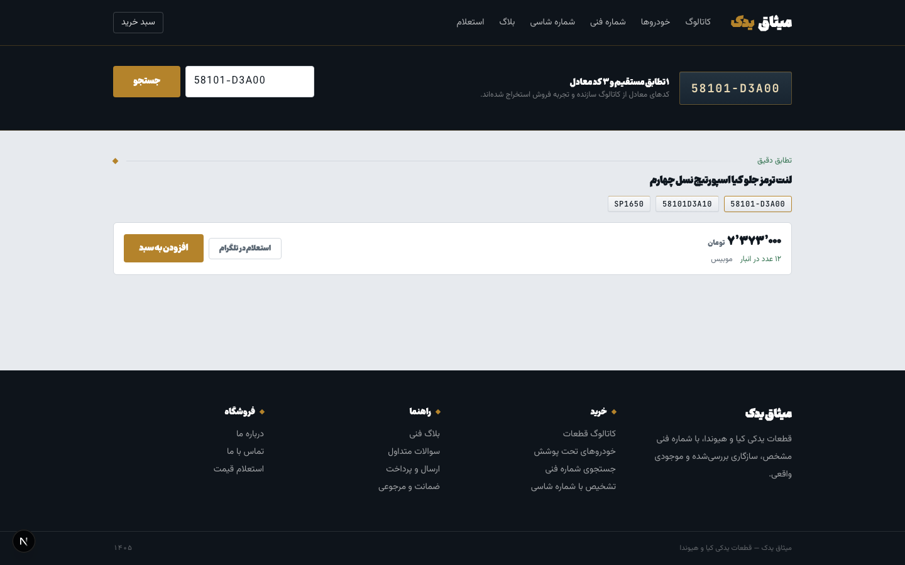
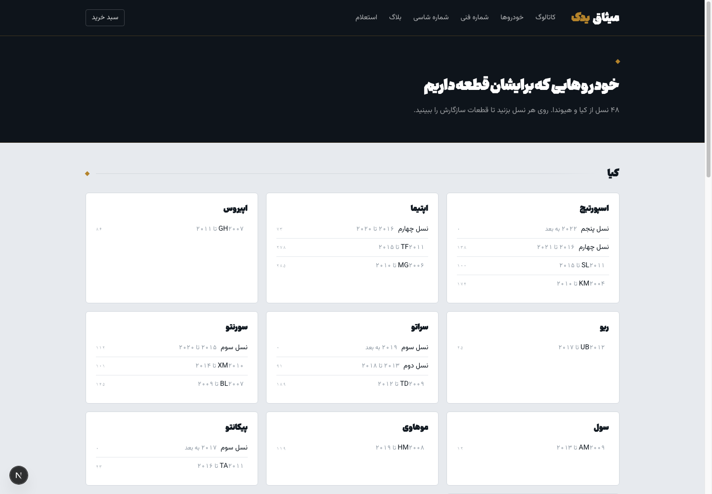
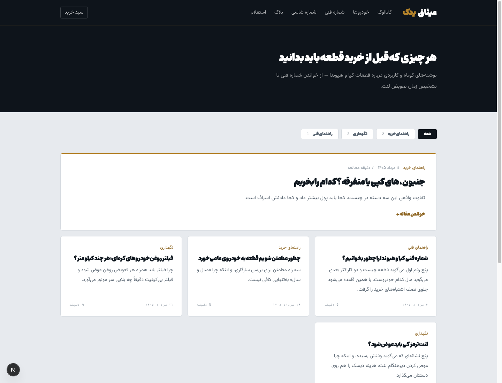

# misagh — فروشگاه قطعات یدکی کیا و هیوندا

فروشگاه اینترنتی قطعات یدکی با سه مسیر جستجو (خودرو، شماره فنی، شماره شاسی)،
کراس‌رفرنس کدهای معادل، و موتور قیمت‌گذاری چندحالته که کاملاً از پنل مدیریت کنترل می‌شود.

## نمای سایت

سایت هنوز روی هاست نرفته است؛ این تصاویر از اجرای واقعی روی داده واقعی گرفته شده‌اند.

### صفحه اصلی


### فهرست محصولات با فیلتر و مرتب‌سازی


### صفحه قطعه


### جستجوی شماره فنی با کدهای معادل


### خودروهای تحت پوشش


### بلاگ فنی


## راه‌اندازی

```bash
docker compose up -d          # پستگرس، میلی‌سرچ، ردیس
npm install
npx prisma migrate dev        # ساخت جدول‌ها
npm run db:seed               # داده اولیه: خودروها، دسته‌بندی، قطعات نمونه
npm run dev                   # http://localhost:3000
```

پنل مدیریت: `/admin`

## استک

| لایه | انتخاب |
|---|---|
| چارچوب | Next.js (App Router) + TypeScript |
| ظاهر | Tailwind CSS v4، راست‌چین. منشور برای تیتر و قیمت، وزیرمتن برای متن، JetBrains Mono برای شماره فنی — همه لوکال در `public/fonts` |
| دیتابیس | PostgreSQL + Prisma (نسخه ۶) |
| جستجوی متنی | Meilisearch (کانتینر بالا هست، اتصالش در فاز بعد) |
| کش و صف | Redis (کانتینر بالا هست، در فاز بعد) |

## ساختار

```
prisma/schema.prisma   مدل داده کامل: خودرو، قطعه، شماره فنی، کراس‌رفرنس، پیشنهاد، قیمت، سفارش
prisma/seed.ts         داده اولیه
src/lib/pricing.ts     موتور قیمت — ارث‌بری پیشنهاد ← قطعه ← تنظیمات
src/lib/catalog.ts     جستجوی شماره فنی با معادل‌یابی، جستجوی خودرو، قیمت‌گذاری پیشنهادها
src/lib/normalize.ts   یکسان‌سازی فارسی، شماره فنی، و دکد VIN
src/lib/settings.ts    تنظیمات فروشگاه با پیش‌فرض‌ها
src/app/admin/         پنل مدیریت: تنظیمات، نرخ ارز، قیمت قطعات و پیشنهادها
src/app/globals.css    سیستم طراحی: کربن، فولاد، برنج + کلاس‌های plate / panel / spec / rule
scripts/set-setting.mts   تغییر یک تنظیم از خط فرمان
```

## موتور قیمت‌گذاری

هر تنظیم قیمتی در سه سطح قابل تعریف است و از بالا به پایین ارث می‌برد:

```
پیشنهاد (Offer)  ←  قطعه (Part)  ←  تنظیمات فروشگاه
```

چهار حالت قیمت:

- **FIXED** — قیمت ثابت ریالی.
- **CURRENCY_LINKED** — قیمت پایه ارزی × نرخ ارز مرکزی. با تغییر نرخ در `/admin/rates` کل سایت به‌روز می‌شود.
- **INQUIRY** — قیمت نمایش داده نمی‌شود؛ دکمه استعلام و لینک تلگرام/واتساپ.
- **HIDDEN** — قطعه دیده می‌شود ولی بدون قیمت و بدون خرید.

روی این‌ها: حاشیه سود، تخفیف زمان‌دار، قاعده رند کردن، **قفل قیمت** (قیمت نهایی ثابت که نرخ ارز
تکانش نمی‌دهد)، اعتبار زمانی قیمت، قیمت همکار، حداقل سفارش، و خاموش کردن نمایش قیمت.

سوییچ‌های قیمتی سه‌حالته‌اند: روشن، خاموش، یا **ارث از سطح بالاتر**. بدون حالت سوم، خاموشِ
پیش‌فرضِ یک پیشنهاد تصمیم قطعه را باطل می‌کرد.

## موجودی

هر قطعه یک `Offer` دارد که قیمت، موجودی و زمان تحویلش را نگه می‌دارد. چون انبار همه قطعات
شمارش نشده، سوییچ «قطعات بدون شمارش، موجود در نظر گرفته شوند» در `/admin/settings` روشن است:
قطعه بدون شمارش «موجود» با زمان تحویل پیش‌فرض نمایش داده می‌شود و قابل خرید است. با انبارگردانی
خاموشش کنید تا موجودی واقعی ملاک شود.

ساختار چند پیشنهادی در دیتابیس هست ولی در رابط کاربری استفاده نمی‌شود — تصمیم فروشگاه این بود
که مشتری بین چند فروشنده مقایسه نکند: یک قطعه، یک قیمت.

## وضعیت فعلی

**کار می‌کند:** کاتالوگ ۵٬۴۴۱ قطعه با شماره فنی و سازگاری خودرو، جستجو از سه مسیر
(خودرو، شماره فنی با معادل‌یابی، شماره شاسی)، صفحه محصول، سبد خرید، ثبت سفارش،
پیگیری سفارش، فرم استعلام و دکمه تلگرام، بلاگ، و پنل مدیریت کامل شامل تنظیمات،
نرخ ارز، قیمت‌گذاری، سفارش‌ها، استعلام‌ها و بلاگ.

**هنوز وصل نشده:** درگاه پرداخت (نیازمند نماد اعتماد و قرارداد درگاه)، ورود پیامکی
مشتری (نیازمند پنل پیامک)، و اتصال Meilisearch برای جستجوی متنی سریع‌تر.
سفارش فعلاً با وضعیت «در انتظار تایید» ثبت می‌شود و هماهنگی پرداخت تلفنی است.

## نکته درباره داده کاتالوگ

داده خودرو و شماره‌های فنی از لیست واردکننده‌ها، فاکتورهای خودمان و کاتالوگ رسمی سازنده وارد
می‌شود. کپی‌برداری از دیتابیس‌های لایسنس‌دار (TecDoc و سایت‌هایی که رویش سوارند) در این پروژه
انجام نمی‌شود.
